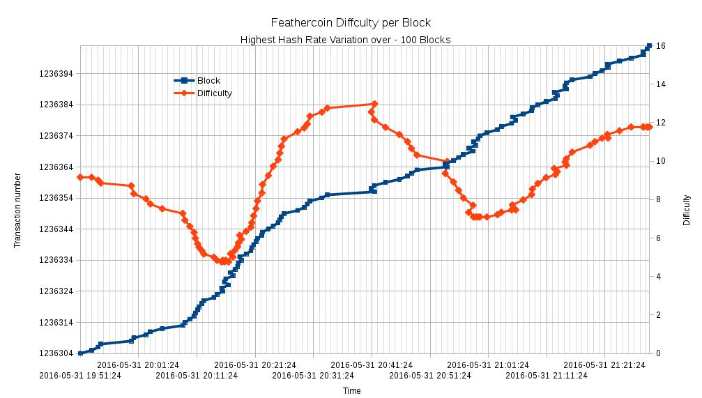
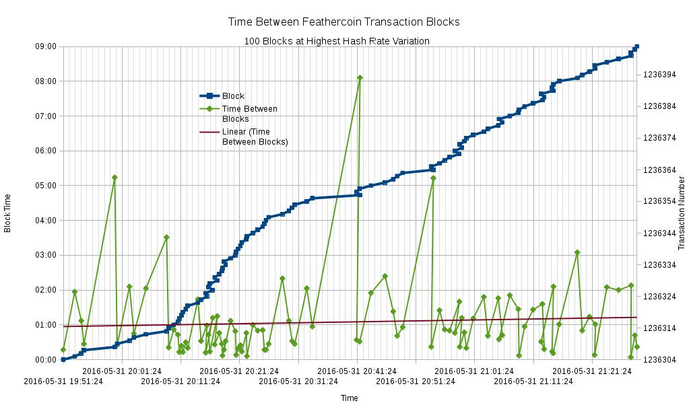
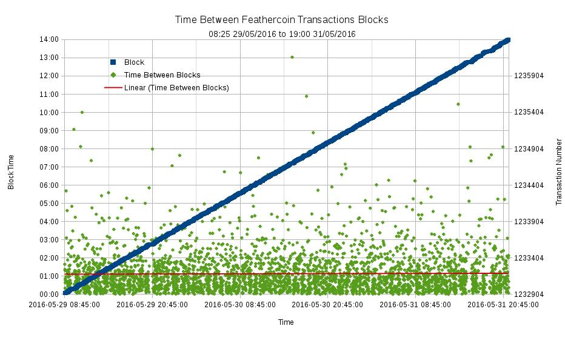
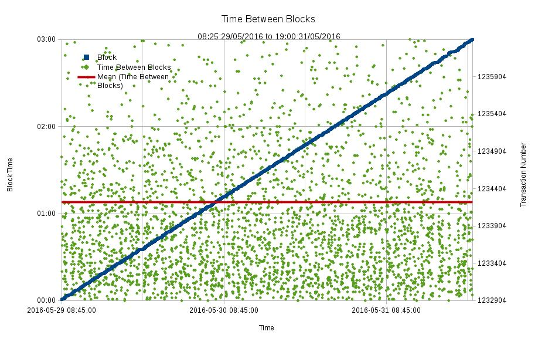
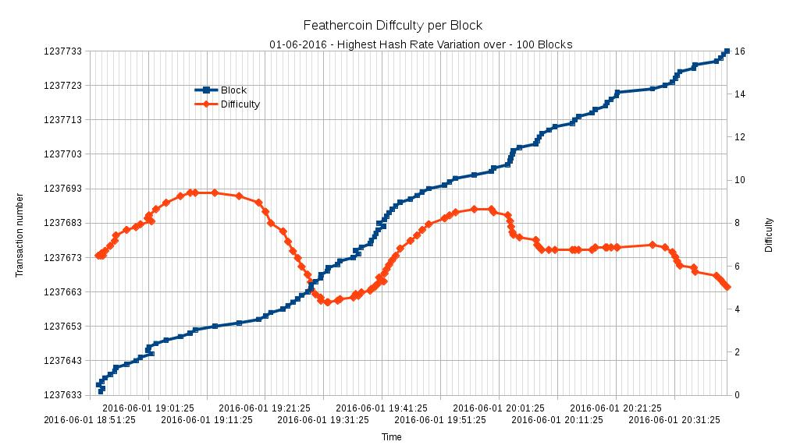
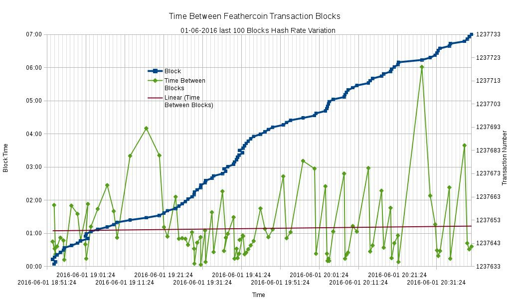
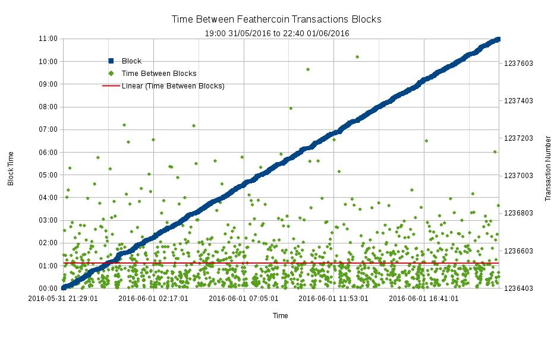
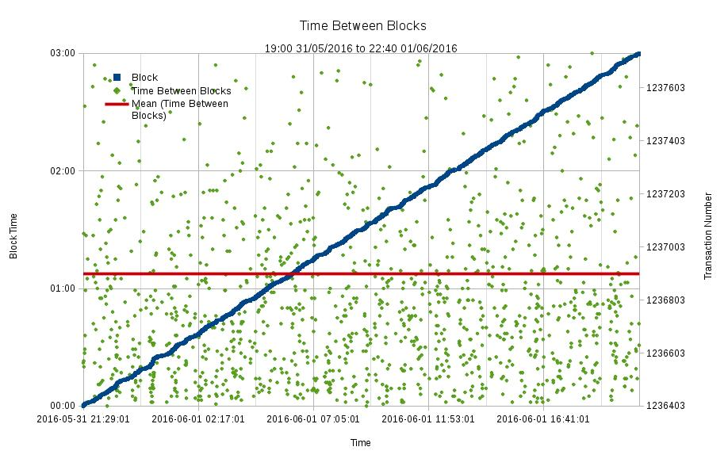

# FTC Block Time Analysis
Methodology and spreadsheet for graphical analysis of Bitcoin-abe Blockchain output
 
**2016-05-31 FTC Transaction Block time and difficulty adjustment Analysis**

Spreadsheet and charts from an analysis of the Feathercoin Blockchain for 100 Hours and over 2 Days. The resulting charts show the variation of the Difficulty and Time between blocks.

The FTC algorithm was designed to efficiently adjust the difficulty to account for rapid changes in Hash rate available to the network was switched between "multi-pools". Currently there is no problem with multi-pools but the move to more distributed mining and the simplification of using NSGminer has meant that it is possible to build a large rig with GPUs and control a large portion of the block transactions.
It is important to see how the algorithm reacts.

Data was extracted from the publicly available Feathercoin Blockchain Explorer, the following command was used in the browser to increase the number of records. That was cut and paste into a text editor to text format it, then pasted into the analysis spreadsheet.

http://explorer.feathercoin.com/chain/Feathercoin?hi=1232903&count=500

**Short term analysis over 100 minutes**

This chart shows how the difficulty adjusted during a 500% variation in FTC Hash rate. The blue diagonal line shows the block frequency against time. This should be a straight diagonal line in ideal situation.

It was noted that some blocks had reverse timing, this is due to the high hash and does not necessarily mean an error. The block are pre - created, so the next block can start to be created before the previous block is confirmed. This is not necessarily good for the high hasher as they must the be following various chains into the future.

It may be that the current cycling nature is due to the variation being over 100%, the high hasher runs out  of future blocks to mine.

It may also be that some pools do not have their time set correctly.

The red line shows the reaction of the difficulty. Although there is always going to be a slight delay to reaction it appears to be as specified and successfully increasing and reducing the Difficulty. The cycles show are 20 mins of hash rate of 400% normal.

Analysis of TheBlockFactory showed it has a FTC Hash rate of 204 MHash/s compared to Overall FTC Hash rate of  654 MHash and "core p2pool" 10 - 50 MHash/s.

However, it would apparently need 5 * 654 or 3,000 MHash/s to produce the variations observed.

**FTC Difficulty variation 31/05/2016**

  

The second chart shows the Time between blocks during a period of extreme hash rate change. FTC eHRC (Hash Rate Compensation) algorithm adjust the difficulty as hash changes to maintain a one minute block time.  Here the green line shows the time between each block, the red line shows the average trend of time for the period. Although when the high hash switches in time between block are low, it does quickly start to compensate and bring the block time back.  

Generally the high hashes are last bellow 2 minutes although one block does take 8 minutes at these extreme levels. A rough calibration of MHash/s per Difficulty 9 = 650 MHash/s, or 72 MHash per Difficulty. The Difficulty is seen to vary from 5 to 13, indicates a variation of global FTC hash rate  from 400 HMash/s to   940 MHash/s. That is a variation of 500 MHash/s

**FTC short term Block time variation 31/05/2016**

  

This chart shows the difficulty medium term, over a couple of days. The block times are scattered around the average, just above one minute.

**FTC medium term Block time variation 31/05/2016**

  

This chart show the block times over a couple of days scaled to show the one minute detail.

**FTC Scaled - medium term Block time variation 31/05/2016**

  

**2016-06-01 24 Hour - FTC Transaction Block time and difficulty adjustment Analysis**

**FTC Difficulty variation 01/06/2016**

  

**FTC short term Block time variation 01/06/2016**

The short term analysis for the 01/06/2016 shows some variation in difficulty, not as extreme as 31st. It can also be seen that the blue diagonal - 1 minute line is straighter, showing the diagnol is an indicator of hash stability. 

  

**FTC medium term Block time variation 01/06/2016**

  

**FTC Scaled - medium term Block time variation 01/06/2016**

  

